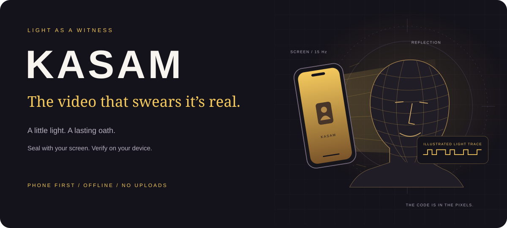
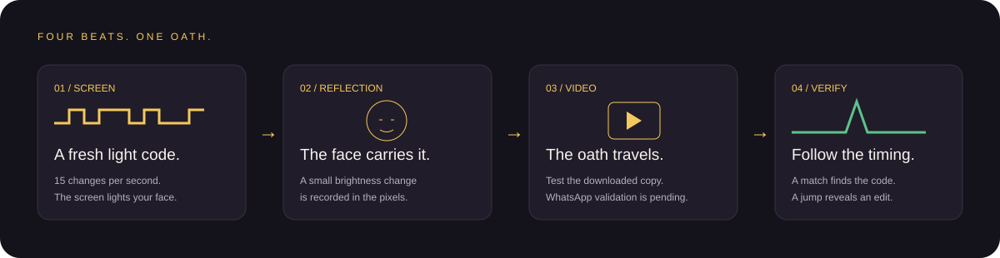
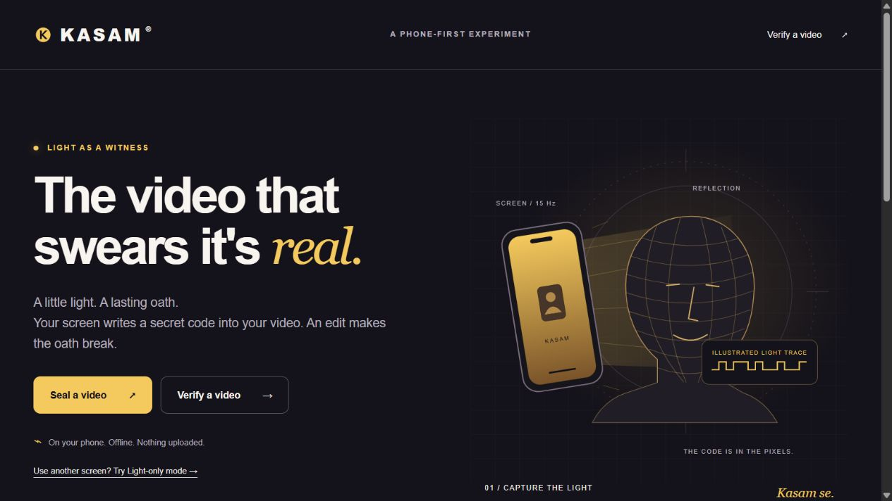

<p align="center"></p>

# KASAM: the video that swears it's real.

KASAM uses your phone's screen to write a fresh light pattern into a selfie video's pixels. Its offline verifier looks for that pattern and timing jumps that can reveal cuts or insertions.

**[Open the live demo](https://rhudhresh.github.io/kasam/)** · **[Source repository](https://github.com/RHUDHRESH/kasam)** · **[Verification evidence](./docs/VERIFICATION.md)**

Published on GitHub Pages from `main` / root. The live original/cut/wrong-code demo and an encoded MP4 test passed; [GitHub Actions verification](https://github.com/RHUDHRESH/kasam/actions/workflows/verify.yml) also passes. Full deployment and device-test evidence is recorded in [VERIFICATION.md](./docs/VERIFICATION.md).

> Phase 1 prototype for the iQOO Hackathon 2026, Open Innovation track. Plain HTML, CSS and JavaScript. No app server. No uploads. No cloud AI. Phone and WhatsApp performance still need real-device measurements.

## Why

**One second can change a story.** Imagine a complaint, an interview or a proof-of-work selfie. Remove the sentence before a pause, forward the clip, and the person in it suddenly seems to be saying something else.

Convincing fake videos are easier to make. Passive detectors offer a probabilistic judgement; metadata-based credentials depend on forwarding tools preserving those credentials. Re-encoding can discard metadata. A visible logo can be cropped or copied.

KASAM asks a different question: **can the original recording carry a witness?** The screen is already beside the camera. The face already reflects its light. Put a known pattern into that light, and the camera records the evidence inside the pixels.

“Kasam” means “I swear.” The video takes an oath. A timing jump makes the oath break: **Kasam toot gayi.**

## How it works

1. **The screen flickers a fresh code.** A random 32-bit seed, shown as eight hexadecimal characters, selects a ±1 pattern at 15 Hz.
2. **The light reaches your face.** A small brightness change rides on its reflection. Most of the screen remains available as the light source.
3. **The camera puts it in the pixels.** The video carries a time-varying brightness signal, rather than a metadata tag. Compression resilience is a hypothesis to measure on each target device and forwarding path.
4. **The verifier follows the timing.** A matching pattern suggests the light code is present. A shift between matching windows can expose a cut or insertion.



The verifier averages luma in the centre 50% × 50% of each decoded frame, resamples at 15 Hz, subtracts a centred one-second moving average, and divides by the signal's standard deviation. It slides the expected pseudo-random code across the signal. A z-score measures how strongly the best correlation stands out from the other candidate lags; it is **not a calibrated probability of authenticity**. Four-second windows, stepped once per second, search within ±3 seconds for alignment jumps. The prototype's thresholds are `NO-GO < 3.5`, `WEAK 3.5–5`, and `GO > 5`, with qualifying timing jumps producing `TAMPERED`.

The original window algorithm labels the start of a matching window, which can precede the actual cut. Both implementations also fit a switch between the pre-edit and post-edit alignments inside that window. Reports preserve the original `atVideoTime` and add `boundaryTime`; the UI labels the latter. See [the exact implementation notes](./docs/VERIFICATION.md).

| Verdict | What the prototype found |
| --- | --- |
| **GO** · Sealed and untouched | Strong code match; no detected timing jumps in the checked windows |
| **TAMPERED** · Oath broken | Code present, with a qualifying alignment jump |
| **WEAK** · Seal is faint | Possible match; repeat with better lighting or stronger amplitude |
| **NO-GO** · No seal | No match for this code; it can also mean wrong code or poor recording conditions |

## Try it in 2 minutes

**No camera handy?** Open **Verify a video → Try a synthetic light-code demo**. It produces a measured result from deterministic samples, labelled as a synthetic test. Turn on **Simulate an edit**, use **8 to 9 seconds**, and analyse again. Then enter `3FA9C21B` to test a wrong seal. These results demonstrate the maths; they do not demonstrate a real optical capture.

For the real test:

1. Open **Seal a video** in Chrome on Android, set screen brightness to maximum, and choose 10% / 20 seconds. Hold the phone 25–35 cm away indoors and keep your face centred.
2. Allow camera and microphone access. Keep the page visible for the one-second lead-in and 20-second light sequence.
3. Download the recording. Keep its eight-character seal code separately with your trusted verifier. Use **Verify now** and choose that file to check the original first.
4. Send the video to yourself through WhatsApp, download the received copy, and verify it with the same code. **Record the actual result below.**
5. Enable **Simulate an edit**, remove seconds 8–9, and analyse again. The simulation drops samples and closes the time gap; it never alters your file.

Downloaded filenames include the seal code so you can pair the file and report. Rename a download before sharing it publicly if you want the code kept separately. The app's Share button uses a generic filename.

**MP4 vs WebM:** the recorder tries MP4/H.264, MP4, WebM/VP9 and WebM in that order. WhatsApp may not accept `.webm`. In **Light-only mode**, use a laptop, tablet or second phone as the light source and the normal camera app on the recording phone to produce MP4. Start the camera before starting the light. A single phone cannot keep this webpage visible while its native camera covers it; switching away interrupts and discards the sequence.

**Privacy & offline:** videos are decoded locally, never uploaded. After the first successful online load, the service worker caches every app page and its assets, so seal, light and verify work offline. Recent codes are stored in this browser's local storage; clearing browser data removes them. The PWA manifest supports installation on compatible browsers. Fullscreen and wake lock are optional browser capabilities.

**GitHub Pages / local preview:** publish this repository's `main` branch from `/ (root)` in **Settings → Pages → Deploy from a branch**. `.nojekyll` keeps the files as authored. Camera access needs HTTPS, or localhost for desktop testing. For local use:

```bash
python -m http.server 8080 --bind 127.0.0.1
# Open http://127.0.0.1:8080/ in Chrome.
```

See [GitHub's publishing instructions](https://docs.github.com/en/pages/getting-started-with-github-pages/configuring-a-publishing-source-for-your-github-pages-site). There is no npm install, bundler or application backend.

## Results

**Synthetic reference checks, measured on 4 October 2026.** The frame generator puts approximately 4% brightness modulation into a face-sized centre region, with deterministic noise and slow exposure drift. These are algorithm checks, not a phone recording or WhatsApp benchmark.

| Test | Amplitude | Result | z | Cut found at |
| --- | --- | --- | --- | --- |
| Synthetic original, seed `12345678` | ≈4% centre-region modulation | GO | 13.620 | None detected |
| Same samples, remove 8–9 s | ≈4% centre-region modulation | TAMPERED | 8.143 | 8.0 s boundary; 1.0 s removed |
| Same samples, wrong seed `3FA9C21B` | ≈4% centre-region modulation | NO-GO | 2.473 | Not analysed |

**Team's real-device tests — pending. No result is implied by the empty rows.**

| Test | Amplitude | Result | z | Cut found at |
| --- | --- | --- | --- | --- |
| iQOO 15 / Chrome / original / indoor | 10% screen setting | [fill in] | [fill in] | [fill in] |
| Same video after WhatsApp forwarding | 10% screen setting | [fill in] | [fill in] | [fill in] |
| Original with simulated 8–9 s cut | 10% screen setting | [fill in] | [fill in] | [fill in] |
| WhatsApp copy with simulated 8–9 s cut | 10% screen setting | [fill in] | [fill in] | [fill in] |
| Real recording / wrong seal code | 10% screen setting | [fill in] | [fill in] | [fill in] |

The screen setting is `level = 1 − amp + amp × code`, so 10% switches between 80% and 100% grey, around a 90% lead-in level. It does not mean the face's measured brightness changes by 10%.

Keep each exported JSON report alongside device, Chrome version, lighting, distance, codec, and forwarding details. [Verification evidence](./docs/VERIFICATION.md) distinguishes pure-signal checks, decoded-video checks and still-pending physical tests.

## Laptop tool

Python 3.9+ and an OpenCV-compatible video codec are required. OpenCV is pinned below version 5. The tool intentionally uses the same centre region as the web app, with no face tracker.

```bash
python -m pip install -r tools/requirements.txt
python tools/kasam_check.py --selftest
python tools/kasam_check.py recording.mp4 --seal 3FA9C21B
python tools/kasam_check.py recording.mp4 --seal 3FA9C21B --amp 0.10 --seconds 20 --cut 8:9
python tools/kasam_check.py recording.mp4 --seal 3FA9C21B --json report.json
```

The CLI prints window scores, edit estimates and a final verdict. `--amp` records metadata; normalized matching does not depend on amplitude. `--selftest` checks the exact mulberry32 bits, synthesises frames in memory, measures their luma, and asserts GO / TAMPERED / NO-GO plus cut localisation.

Optional contributor check, if Node is already installed (it is not an app dependency):

```bash
node tools/check.mjs
```

## Honest limits

- **Strong sunlight can drown the screen's light.** Distance, face motion, exposure control, dropped code transitions and compression can weaken the match. Better optics matter more than the badge.
- **The seal-code holder must be trusted.** This 32-bit seed and mulberry32 are a reproducible demo pattern, not a cryptographically secure challenge. Someone who knows or estimates the pattern can synthesize it.
- **The intended check is recording integrity, not truth.** A GO means a strong pattern match without detected timing jumps; it does not prove identity, factual truth, live presence, the authenticity of audio, or absence of every kind of edit.
- **The prototype uses the centre of the frame, not a face tracker.** A bright background or the wrong framing can dominate the signal. It cannot yet localize a pasted face or object spatially.
- **Windowed matching has blind spots.** Short edits, changes near clip ends, replays, audio-only edits, and shifts beyond the ±3-second search may be missed. Real frame timing can also cause false alarms. A partial clip can match; GO is not a cryptographic guarantee of completeness.
- **Noise can produce false edit flags.** An uncut synthetic clip with heavy added noise returned TAMPERED in a stress test. The prescribed thresholds are a research starting point and need calibration on real devices.
- **Seeds are random for each recording.** Production needs a reviewed threat model, secured HMAC challenge generation, binding to capture and time, secure keystore keys, and replay protection. Replacing a PRNG alone is insufficient.
- **Phone and WhatsApp success are unproven here.** Synthetic tests are useful engineering evidence, and cannot substitute for the team running the real-device acceptance checklist.
- **The visible light may be uncomfortable.** Stop if it bothers you. This prototype is not intended as a medical, legal or KYC decision system.

## Roadmap (iQOO 15 native app)

The Phase 1 prototype isolates the physical signal. The finale build can add an on-device model where it has a useful job:

- **Android / Kotlin / CameraX:** controlled capture, frame timestamps and better exposure handling.
- **Face model on the Snapdragon NPU:** measure the face rather than an assumed centre rectangle.
- **Llama 3.2 on-device:** explain measured results in Hindi and English; it must not invent evidence or decide integrity by itself.
- **Replay check:** explore how a flat screen and a 3D face distribute reflected light. Validate before making liveness claims.
- **“Words in light”:** investigate binding the challenge to the spoken content, with secured HMAC keys in the phone's keystore.
- **Office Kit verification desk:** move the recording and report to a laptop for a judge-friendly evidence view.
- **Spatial code heatmap:** measure per-region correlations to explore pasted content. This stretch feature is not included in the current verifier.

The planned live challenge: **“Fool KASAM, win ₹1,000.”** A judge chooses an attack, a teammate performs it, and the verifier shows its evidence before the card is revealed. The current prototype supports a transparent, reproducible cut demonstration; the other attacks need validated implementations first.



## Prior art and credits

KASAM explores screen-based capture and offline timing verification. The physical watermarking idea has strong prior art; this project does not claim to have invented coded illumination.

- **Cornell noise-coded illumination / SIGGRAPH 2025:** [Hiding secret codes in light protects against fake videos](https://news.cornell.edu/stories/2025/07/hiding-secret-codes-light-protects-against-fake-videos). Programmable illumination embeds codes into recorded scenes. KASAM's inspiration and primary credit.
- **Columbia VeriLight / CCS 2025:** [Combating Falsification of Speech Videos with Live Optical Signatures](https://mobilex.cs.columbia.edu/verilight/). Event-bound physical optical signatures for speech-video verification.
- **iProov Flashmark:** [controlled screen illumination for Dynamic Liveness](https://www.iproov.com/biometric-encyclopedia/flashmark). A commercial precedent for screen-to-face reflection checks with cloud verification.
- **Face Flashing / 2018:** [Face Flashing: a Secure Liveness Detection Protocol based on Light Reflections](https://arxiv.org/abs/1801.01949).

All illustrations in this repository are original SVGs. App screenshots are captured from this build. No external fonts, images, analytics, APIs or CDNs are loaded by the application. The UI certificates use fixed English/Hindi templates; this web prototype does not run an AI model.

## Team

**[names]** — add the three team members and their roles before submitting. Project brief prepared for Joyal, 4 October 2026. [Original project context](./docs/CONTEXT.md).

**License:** [MIT](./LICENSE).
