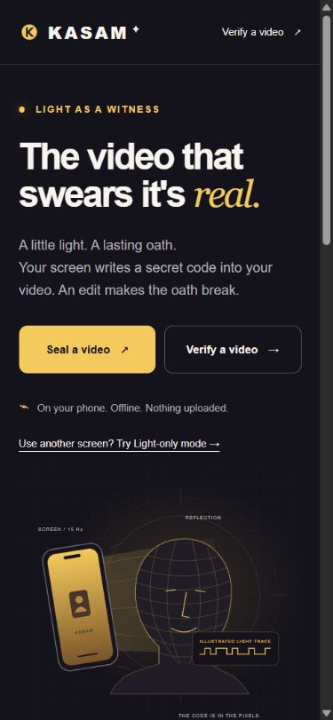
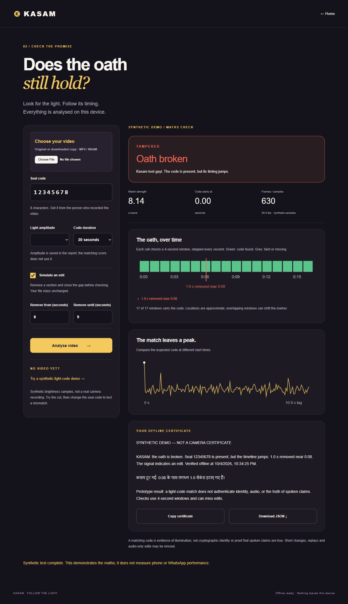

# KASAM verification record

Measured on **4 October 2026**. This record separates software checks from physical phone tests. A passing synthetic test does not prove that a phone's reflected light survives a real camera and WhatsApp.

## Reproducible maths

Run:

```bash
python -m pip install -r tools/requirements.txt
python tools/kasam_check.py --selftest
node tools/check.mjs
```

Node is only needed for the development parity check. The app itself has no Node dependency. Set `KASAM_PYTHON` if your Python executable is not named `python`.

Checks passed:

- Exact expected first eight bits for seed `12345678`.
- JavaScript/Python PRNG parity across five seeds, including unsigned boundaries, for 128 bits per seed.
- JavaScript/Python correlation and z-score parity within `1e-10` for original, cut and inserted signals.
- Original GO, one-second cut TAMPERED, one-second insertion TAMPERED, wrong seed NO-GO, constant signal NO-GO.
- Correct behaviour for 10-, 20- and 30-second code durations.
- Rejection of malformed seals, non-increasing timestamps, too-short signals and invalid cut ranges.
- Local HTML paths, service-worker assets and manifest icon paths exist. JavaScript syntax and Python compilation passed. SVG assets parse correctly. `.nojekyll` is empty.

| Signal | Ground truth | Result | z | Estimated boundary / shift |
| --- | --- | --- | --- | --- |
| In-memory synthetic frames | Uncut | GO | 13.620 | No edit |
| Same frames, remove 8–9 s | Cut | TAMPERED | 8.143 | 8.000 s / −1.000 s |
| Same frames, use `3FA9C21B` | Wrong code | NO-GO | 2.473 | No timeline |
| Add an unsealed second at 8 s | Insertion | TAMPERED | 9.231 | 8.667 s / +1.000 s |

[Full reference JSON](./verification-results.json) contains correlation arrays and window scores generated by `--selftest`.

## Encoded video and recording checks

The reference generator made a 21-second, 30 fps video with 320 × 240 grey frames. The centre 50% × 50% carries a 5/120 ≈ 4.17% modulation, deterministic noise and slow drift. OpenCV 4.14 encoded it as VP8/WebM. **This is a synthetic video, not a face recording.**

| Decoder / path | Original | Cut 8–9 s | Wrong code |
| --- | --- | --- | --- |
| OpenCV frame decoding | GO, z = 13.544 | TAMPERED, z = 8.157, boundary 8.0 s | NO-GO, z = 2.394 |
| Browser decoded-frame callbacks | GO, z = 13.69, 622 frames | TAMPERED, z = 7.99, boundary near 0:08 | Pure-signal wrong-code check passed |
| Browser 30 Hz seeking fallback | GO, z = 13.580, 630 samples | TAMPERED, z = 7.996, boundary 8.0 s, −1.0 s | Pure-signal wrong-code check passed |

Frame-callback results can vary slightly with playback scheduling and dropped callbacks. The UI reports the number of frames it actually samples and their effective rate.

The recorder was also tested with a **generated canvas stream**, whose centre brightness follows the page's light. No real camera or microphone was accessed for that test. The production recorder selected H.264 MP4, completed a 10-second code with its lead-in, released fullscreen, displayed a playable result, saved its code to recent seals, and supplied the correct Verify now URL parameters.

- Generated recording: seal `4441BADC`, 11.513-second MP4.
- Browser verification of that recording: **GO, z = 9.612**, 292 sampled frames.
- OpenCV verification of the same encoded bytes: **GO, z = 10.300**, 332 decoded frames.

The browser harness and generated videos live in ignored `output/qa/`. They are not part of the deployed application and never replace the real camera in the production pages.

## Browser and offline checks

The home and verifier were opened in desktop Chrome and Chromium. The synthetic demo, verdicts, correlation chart, timing strip and bilingual certificates rendered without observed console errors. Certificate copying succeeded. The report link produces a local JSON Blob with its seal filename.

The automation's download-event capture timed out, and browser policy prevented opening Chrome's internal download manager. **Native download saving and Android Web Share still need a manual device check.** The generated recorder's encoded bytes were independently decoded and verified; that is a codec check, not a claim that every device's download UI was tested.

The layout was inspected at a 390 × 844 phone viewport. Screenshots below are actual captures, not mockups.

**Offline desktop check passed:** after the initial cache installation, the local HTTP server was stopped. Home, Seal and Light-only loaded from the service worker. Light-only completed its 10-second code with a one-second lead-in, and the verifier's synthetic original / cut checks ran with the server still stopped. This is a desktop offline check; Android airplane mode remains pending.





## Two sampling fixes

**Cut localisation:** the prescribed four-second-window algorithm flags the beginning of a matching window. For the 8–9 s synthetic cut, its original `atVideoTime` is 6.0 s. Both verifiers preserve that field, and add `boundaryTime`: within the affected region, maximise the correlation obtained by switching once from the previous offset to the new offset. That places this cut at 8.0 s. The displayed text uses the refined estimate. Neither field is a confidence interval.

**Seeking fallback:** seeking at exact nominal frame boundaries can select the preceding frame because encoded timestamps are rounded. The fallback seeks 1 ms into each requested 1/30-second step and keeps that actual requested time in its sample array. This removed extra spurious shifts observed in the first fallback check. Decoded-frame callbacks remain the primary path.

## Stress-test finding

The specified thresholds are not calibrated for production. Adding deterministic heavy noise (`mulberry32(42)`, noise `(random − 0.5) × 60`) to the uncut synthetic signal returned **TAMPERED at z = 4.711**, with false timing jumps. This is a known failure, not a successful attack test. The UI and README state that noise and capture conditions can cause false alarms; the next engineering step is real-device threshold calibration and a stronger temporal confidence model.

## Real-device acceptance checklist

The following require a physical Android phone and are **pending**:

- Camera and microphone permissions, front-camera quality, actual reflected modulation and exposure response.
- Original selfie returning GO with z > 5 at 10% amplitude indoors.
- The same selfie with a simulated 8–9 s cut returning TAMPERED within ±1.5 s of the cut.
- A wrong code on that real recording returning NO-GO.
- Download saving, playback in the phone's gallery, file-based Web Share and PWA installation.
- Airplane mode on Android after a successful online cache installation.
- Native-camera MP4 captured with a second screen in Light-only mode.
- WhatsApp-forwarded copies, with the real scores entered in the README.

For each trial, keep the original and forwarded file, exported JSON, device / Chrome version, brightness setting, amplitude, room lighting, distance and codec. Do not replace pending rows with synthetic numbers.

## Publishing

The public repository [RHUDHRESH/kasam](https://github.com/RHUDHRESH/kasam) was created through the signed-in Chrome browser. GitHub Pages is enabled from `main` / root, with enforced HTTPS, at [the live app](https://rhudhresh.github.io/kasam/).

Verified on the deployed app, 4 October 2026:

- Landing page, original illustration and app navigation render under the `/kasam/` project path.
- Service worker installation reaches **Offline ready**.
- Synthetic original: **GO**, z **13.62**. Simulated removal of 8–9 s: **TAMPERED**, z **8.14**, **1.0 s removed near 0:08**. Wrong code `3FA9C21B`: **NO-GO**, z **2.47**.
- The production-recorder MP4 generated from the local canvas test stream is selected through the deployed file picker and decoded locally: seal `4441BADC`, 10-second code, **GO**, z **10.22**, 291 sampled frames, 25.3 fps, lag **1.53 s**. This is an encoded test video, not a physical-camera illumination test. Browser scheduling changes sampled counts and scores slightly between runs.
- No browser warnings or errors were observed during those live checks.
- [Initial Pages deployment](https://github.com/RHUDHRESH/kasam/actions/runs/37221457199) and [deployment after CI addition](https://github.com/RHUDHRESH/kasam/actions/runs/37221556734) completed successfully.
- [Verify KASAM run #1](https://github.com/RHUDHRESH/kasam/actions/runs/37221558464) completed successfully. The workflow checks JavaScript and Python syntax, runs the synthetic-frame self-test, and runs the PRNG/signal parity and asset checks. It repeats on pushes to `main` and pull requests.

The physical Android, optical and WhatsApp acceptance checklist above remains pending. Automated checks do not replace it.
